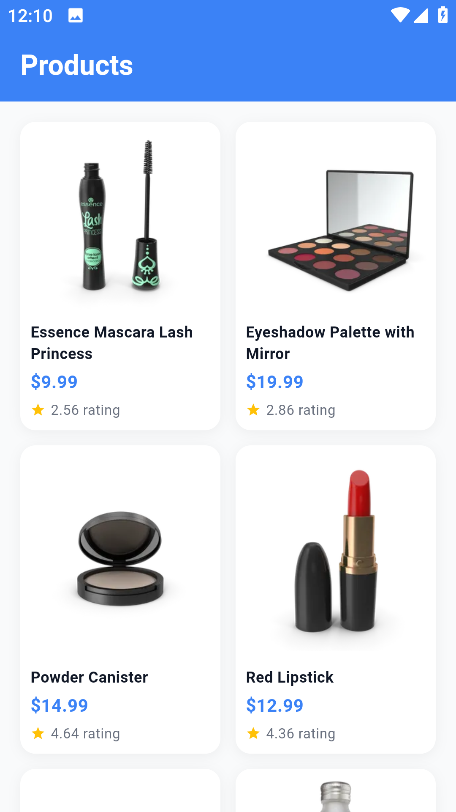
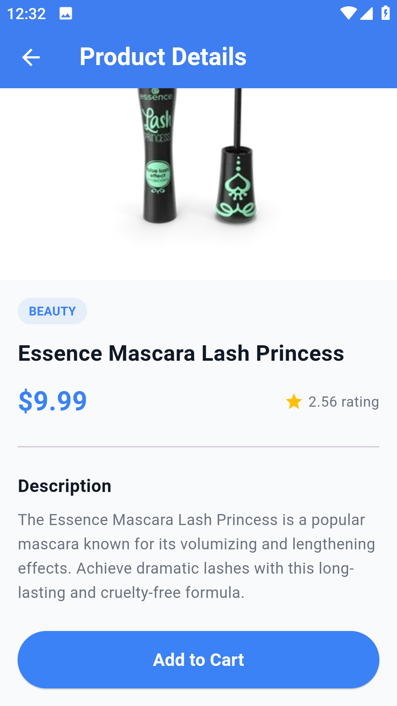
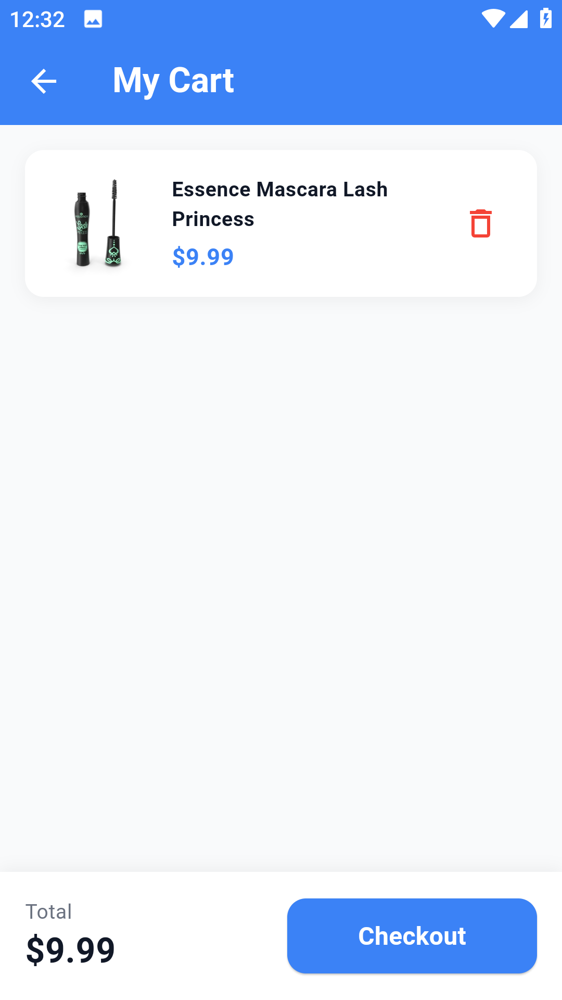

# 🛒 E-Commerce App

A full-featured e-commerce mobile app built with Flutter using Clean Architecture and BLoC pattern.

## ✨ Features
- Browse products from real API
- Product details screen
- Add to cart & remove from cart
- Total price calculation
- Clean and modern UI

## 🛠️ Tech Stack
- Flutter & Dart
- BLoC State Management
- REST API & Dio
- Clean Architecture
- DummyJSON API

## 📸 Screenshots

## 🚀 Getting Started
1. Clone the repo
2. Run `flutter pub get`
3. Run `flutter run`
